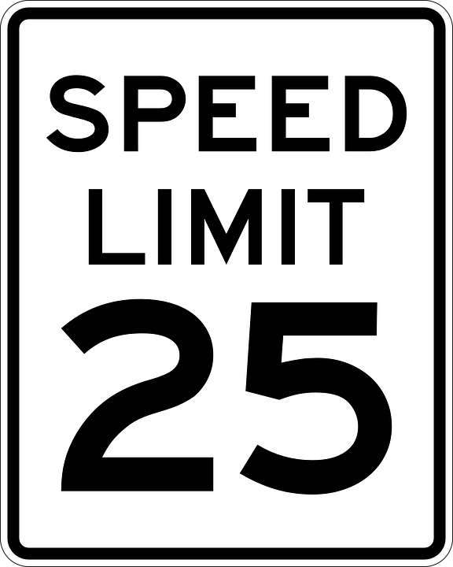

# <i class="fa fa-database"></i> INFOSYS 222
### Break 01: Pomodoro
<i class="fa fa-copyright"></i> [Johnny Chan](mailto:jh.chan@auckland.ac.nz) | <i class="fa fa-twitter"></i> [@infosys222](http://twitter.com/infosys222)

## Scott Hanselman

<!-- .slide: data-background-image="http://pomodorotechnique.com/wp-content/themes/pomodoro/img/logos/logo.png" data-background-size="400px" data-transition="zoom" -->

# 50 = 25 + 5 + 20
