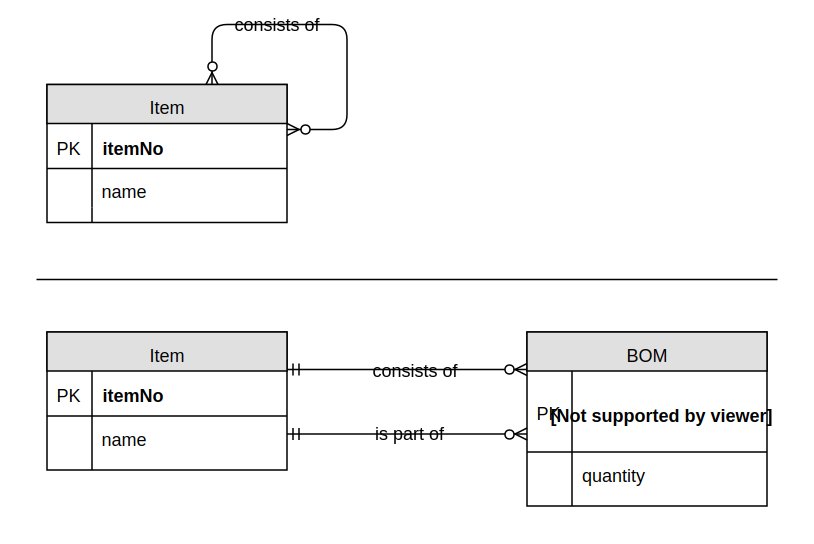

# <i class="fa fa-database"></i> INFOSYS 222
### Week 03: Entity-relationship modelling
[Johnny Chan](mailto:jh.chan@auckland.ac.nz) | [@infosys222](http://twitter.com/infosys222)

## <i class="fa fa-history"></i> Previously on 222 ...
- Relational data model
	- relation, tuple, attribute, domain, schema, key, constraint

- SQL
	- CREATE TABLE, DROP TABLE, ALTER TABLE
	- Declaring constraints
	- INSERT, UPDATE, DELETE

- SQLite

## <i class="fa fa-list-alt"></i> Agenda
- Data modelling

	- Entity-relationship (ER) modelling

	- ER diagram (ERD)

- Case study

## Data modelling
- Data modelling is the _process of creating a data model_ for a given set of data
	- conceptual → logical → physical

- How data are defined, structured and stored would have a _significant implication_ to how they can be accessed and manipulated

- 🤔 What makes a good data model?

- During the stage of physical data modelling it is often necessary to consider the data model’s impact on the efficiency of database operations

## ER model

- The concept is originally defined by [Chen (1976)](https://auckland.rl.talis.com/items/B68EEFEE-FAA3-9B64-1576-47912B3F3053.html?referrer=%2Flists%2F67385800-22DC-21D5-CBF3-00CC4AFE9E1E.html%23item-B68EEFEE-FAA3-9B64-1576-47912B3F3053) which has been adopted and refined by practitioners as the leading method to carry out data modelling

- An ER model is a _systematic way_ of describing and defining a business process. The process is modelled as _entities_ that are linked with each other by _relationships_ that express the dependencies and requirements between them

- An ERD is used as a tool for ER modelling, which also provides a representation of the ER model

- <i class="fa fa-book"></i> Further: [ER model from Wikipedia](http://en.wikipedia.org/wiki/Entity%E2%80%93relationship_model)

## Entity
- An __entity__ is an object (abstract or physical)
	- "Interstellar", "Matthew McConaughey"
	- "University of Auckland", "OGG Building"

- Entities are grouped into __entity set__ or entity type / class
	- Movie, Actor
	- University, Building

- An entity set is conventionally named with a singular noun
	- related to business characteristics, meaningful and self-documenting; unique and concise, readable

- 📢 In ER modelling, sometimes an entity set is called an entity, whereas an entity is called an instance

## Relationship

- Two entity sets may be connected in some way. In the ER model this can be expressed as a __relationship__
	- The Movie and Actor entity sets are connected by actors starring in movies. For example, "Interstellar" is connected to "Matthew McConaughey"

- Degree
	- unary, binary, ternary, n-nary

- [Cardinality](http://en.wikipedia.org/wiki/Cardinality_(data_modeling)
	- Multiplicity: one-to-one, one-to-many, many-to-many
	- Optionality: optional or mandatory

## Conceptual ERD

<small>Figure 3.1: Conceptual ER model of a product management system</small>

## Degree and cardinality
  
<small>Figure 3.2: Unary and binary relationships with different cardinalities</small>

## Multiple relationships

<small>Figure 3.3: Multiple relationships established among two entity sets</small>

## Attribute
- An __attribute__ is a property or a characteristic of an entity set (or a many-to-many relationship)
	- The entity set Actor might be given attributes name, address, gender and birthDate
	- Each entity in the entity set would have values associated with each attribute

- The value of attribute
	- atomic (single-valued) vs multivalued
	- stored vs derived

## Key
- In most cases, an entity can be uniquely identified in its entity set by the values of its attributes
	- A set of attributes whose values uniquely identify an entity in its entity set is called a __key__ or a __candidate key__
	- If there are several candidate keys, we choose one of them as the __primary key__, where its value must not change and must not be [null](https://en.wikipedia.org/wiki/Null_(SQL)

- Example: AUID could be chosen as the primary key for the Student entity set

## ERD with attribute

<small>Figure 3.4: Conceptual ERD with attribute and key among entity sets and relationships</small>

# <i class="fa fa-briefcase"></i> Case study
### An art museum <!-- .slide: data-background="art.jpg" data-background-transition="zoom" -->

## Objective
- Read the specification carefully, then:

	- draw a conceptual ERD to represent the given case study

	- extend the conceptual ERD with attribute

## Specification
- An art museum owns a large volume of works of art. Each work of art is identified by an item code. Each work can be described using a title, the size – composed of height, width and weight. A work of art is developed by an artist. The artist of some works is not known. An artist is identified by an artist number and described by name, age, gender, dob and dod (null for living artists!). Only data about artists for works currently owned by the museum are kept in the database

## More specification
- At any time, an art work is either displayed in the museum, held in storage, away from the museum as part of a travelling show, or on loan to another gallery. If on display the location of the display (in the museum) is noted. A travelling show is described by a show ID, city in which the show is currently appearing, and the start and end dates of the show. Many of the museum works can be part of a given show. One art work can be displayed in many shows over time. These need to be recorded for future analysis. A gallery is described by a gallery identifier, name and city. The museum wants to retain a history of all works of art loaned to another gallery. The date loaned and the date returned must be recorded and retained.

## The modelling process
- Entity set
	- <!-- .element: class="fragment" --> Artwork (__itemCode__, title, height, width, weight)
	- <!-- .element: class="fragment" --> Artist (__artistNo__, name, gender, dob, dod)
	- <!-- .element: class="fragment" --> Show (__showID__, city, startDate, endDate)
	- <!-- .element: class="fragment" --> Gallery (__galleryID__, name, city)
	- <!-- .element: class="fragment" --> Location (__locID__, locDesc)

- Relationship
	- <!-- .element: class="fragment" --> Artist develops Artwork (optional one to mandatory many)
	- <!-- .element: class="fragment" --> Location displays Artwork (optional one to optional many)
	- <!-- .element: class="fragment" --> Show stores Artwork (optional many to mandatory many)
	- <!-- .element: class="fragment" --> Gallery borrows Artwork (optional many to mandatory many) with loanDate and returnDate

## Conceptual ERD

<small>Figure 3.5: Conceptual ERD of the art museum case</small>

## ERD with attribute

<small>Figure 3.6: Conceptual ERD with attribute for the art museum case</small>

## Conceptual to logical
- [Conceptual data model](https://en.wikipedia.org/wiki/Conceptual_schema)
	- a high-level description of the informational needs of a business
	- it describes the things of significance (entity sets), about which it is inclined to collect information, and characteristics of (attributes) and associations between pairs of those things of significance (relationships)

- [Logical data model](https://en.wikipedia.org/wiki/Logical_data_model)
	- a detailed representation of some or all of an organization's data, independent of any particular database management technology, and described in business language
	- the content is adjusted to achieve certain efficiencies

## Associative entity set
- In logical data modelling, one major task is to resolve __all__ many-to-many relationship in the conceptual data model by converting them to [__associative entity set__](https://en.wikipedia.org/wiki/Associative_entity)

- 🤔 Why is this step necessary?

- An associative entity set is used to represent a relationship which often has its own attribute that do not belong to other entity set

- Each many-to-many relationship would be resolved into two one-to-many relationships with an associative entity set

## Example

<small>Figure 3.7: Resolving a binary many-to-many relationship into an associative entity set</small>

## Another example

<small>Figure 3.8: Resolving an unary many-to-many relationship into an associative entity set</small>

## Quiz 01
- Draw a logical ERD to represent the following case

	- Each vendor can supply many parts to any number of warehouses but need not supply and parts
	- Each part can be supplied by any number of vendors to more than one warehouse, but each part must be supplied by at least one vendor to a warehouse
	- Each warehouse can be supplied with any number of parts from more than one vendor, but each warehouse must be supplied with at least one part

## Quiz 02
- Revisit the [art museum case study](#/4)

- Draw a logical ERD to represent the case study and list all assumptions made

## Quiz 03
- Modify the logical ERD of the [art museum case study](#/4) from [Quiz 02](#/7) to accommodate one additional requirement:

	- the museum would like to keep track of the history of displaying the works of art in different locations over time, with a start date and an end date recorded

## Existence dependency
- __Strong__ entity set
	- exists independent of other entity set
	- has its own unique identifier

- __Weak__ entity set
	- existence dependent on a strong entity set
	- does not have a unique identifier (only a partial identifier)

- The relationship between a strong entity set and a weak entity set is called an __identifying__ relationship, as opposed to __non-identifying__ relationship

## Strong and weak

<small>Figure 3.9: A strong entity set and a weak entity set with an identifying relationship</small>

## <i class="fa fa-list-alt"></i> Summary
- By now you should:

	- know the vocabulary of the ER model: entity, entity set, relationship, degree, cardinality, attribute, key etc

	- know how to create a data model with conceptual and logical ERD

	- have some fundamental knowledge of how to resolve many-to-many relationship with an associative entity set

	- understand the importance of assumption in ER modelling

	- understand the difference between strong and weak entity sets

## <i class="fa fa-book"></i> Reading
- Further
	- The ER model  
		[Chen (1976): The Entity-Relationship Model - Toward a Unified View of Data](https://auckland.rl.talis.com/items/B68EEFEE-FAA3-9B64-1576-47912B3F3053.html?referrer=%2Flists%2F67385800-22DC-21D5-CBF3-00CC4AFE9E1E.html%23item-B68EEFEE-FAA3-9B64-1576-47912B3F3053)

	- Crow's foot (Martin) notation  
	 	[Steve (2002): The Details of Conceptual Modelling Notations are Important - A Comparison of Relationship Normative Language (p174-p176)](https://auckland.rl.talis.com/items/9C0E5583-E41A-4647-F735-77357D02ECC8.html?referrer=%2Flists%2F67385800-22DC-21D5-CBF3-00CC4AFE9E1E.html%23item-9C0E5583-E41A-4647-F735-77357D02ECC8)

## <i class="fa fa-calendar"></i> Schedule
Week | Lecture | Lab
--- | --- | ---
01 | Introduction <i class="fa fa-check fa-pull-right"></i>| No lab <i class="fa fa-check fa-pull-right"></i>
02 | Relational model <i class="fa fa-check fa-pull-right"></i>| Introduction <i class="fa fa-check fa-pull-right"></i>
03 | ER modelling <i class="fa fa-check fa-pull-right"></i>| ER diagram <i class="fa fa-spinner fa-pulse fa-pull-right"></i>
04 | Data modelling | Data modelling
05 | Data modelling | Workshop
06 | Normalisation | Normalisation
07 | SQL | SQL
08 | SQL | SQL
09 | SQL | SQL
10 | DBMS fundamentals | Workshop
11 | Data warehouse | Data warehouse
12 | Review | No lab

# THE END
<canvas width=300 height=300 class="anything">
<!--
{
  "initialize": "function(container) {
	var width = container.width,
	    height = container.height;
	var projection = d3.geo.orthographic()
	    .translate([width / 2, height / 2])
	    .scale(width / 2 - 20)
	    .clipAngle(90)
	    .precision(0.6);

	var c = container.getContext('2d');

	var path = d3.geo.path()
	    .projection(projection)
	    .context(c);

	var title = container.parentElement.querySelector('.country');
	queue()
	    .defer(d3.json, '../asset/world-110m.json')
	    .defer(d3.tsv, '../asset/world-country-names.tsv')
	    .await(ready);

	function ready(error, world, names) {
	  if (error) throw error;

	  var globe = {type: 'Sphere'},
	      land = topojson.feature(world, world.objects.land),
	      countries = topojson.feature(world, world.objects.countries).features,
	      borders = topojson.mesh(world, world.objects.countries, function(a, b) { return a !== b; }),
	      i = -1,
	      n = countries.length;

	  countries = countries.filter(function(d) {
	    return names.some(function(n) {
	      if (d.id == n.id) return d.name = n.name;
	    });
	  }).sort(function(a, b) {
	    return a.name.localeCompare(b.name);
	  });

	  (function transition() {
	    d3.transition()
	        .duration(1250)
	        .each('start', function() {
			while ( !countries[i = (i + 1) % n] ) {};			
			title.innerHTML = (countries[i].name);
	        })
	        .tween('rotate', function() {
	          var p = d3.geo.centroid(countries[i]),
	              r = d3.interpolate(projection.rotate(), [-p[0], -p[1]]);
	          return function(t) {
	            projection.rotate(r(t));
	            c.clearRect(0, 0, width, height);
	            c.fillStyle = '#fff', c.lineWidth = 2, c.beginPath(), path(globe), c.fill();
	            c.fillStyle = '#42affa', c.beginPath(), path(land), c.fill();
	            c.fillStyle = '#f00', c.beginPath(), path(countries[i]), c.fill();
	            c.strokeStyle = '#ccc', c.lineWidth = .5, c.beginPath(), path(borders), c.stroke();
	            c.strokeStyle = '#ccc', c.lineWidth = 2, c.beginPath(), path(globe), c.stroke();
	          };
	        })
	      .transition()
	        .each('end', transition);
	  })();
	}

	d3.select(self.frameElement).style('height', height + 'px');

    }"
}
-->
</canvas>

#### Database rules in Country!
[<i class="fa fa-print"></i>](?print-pdf#)
