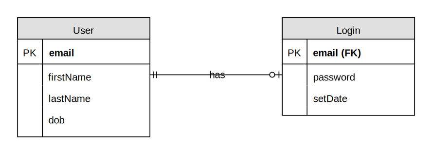
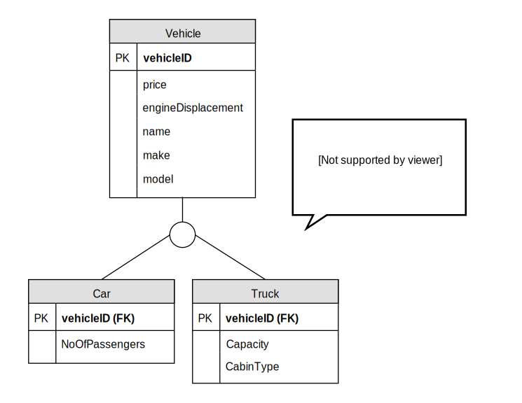
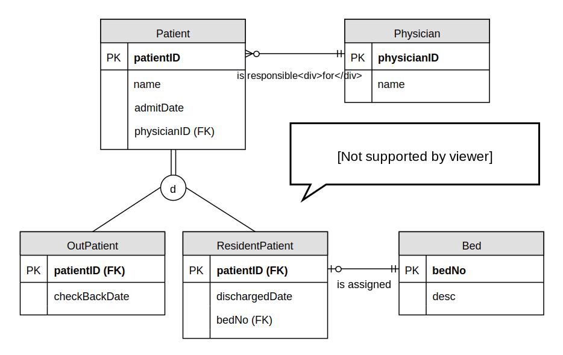

# <i class="fa fa-database"></i> INFOSYS 222
### Week 04: Data modelling
[Johnny Chan](mailto:jh.chan@auckland.ac.nz) | [@infosys222](http://twitter.com/infosys222)

## <i class="fa fa-history"></i> Previously on 222 ...
- ER model
	- entity, entity set, relationship, attribute and key
	- degree and cardinality of relationship
	- associative, strong and weak entity sets

- Data modelling
	- conceptual data modelling
	- logical data modelling

- ERD
	- crow's foot notation

## <i class="fa fa-list-alt"></i> Agenda
- Revisit some concepts

- Design principles for data modelling

- [Enhanced ER model](https://en.wikipedia.org/wiki/Enhanced_entity%E2%80%93relationship_model)
	- superset and subset
	- specialisation and generalisation
	- completeness, disjointness and discriminator
	- the concept of anybody

- Case study

## Revisit the models
ER model | Relational model | SQL
--- | --- | ---
entity set | relation | table
entity | tuple | row
attribute | attribute | column
key | key | key

## Foreign key
- In ER modelling, a [foreign key](http://en.wikipedia.org/wiki/Foreign_key) is defined for every relationship. For a typical one-to many, the foreign key stays with the child entity set on the many side, where it references the primary key of the parent/master entity set on the one side

- It is common to rename the foreign key in the child entity set, particularly in an unary relationship

- Allowing null or not for a foreign key specifies if the relationship is mandatory or optional

- If the foreign key becomes part of the primary key in the child entity set, that makes the entity set weak

- Foreign key = controlled data redundancy

## Referential integrity
- While primary key is an important element to uniquely identify each entity in a set, foreign key is a critical element for representing relationship

- It is the mean to protect [referential integrity](http://en.wikipedia.org/wiki/Referential_integrity)

- Referential actions (at the DBMS level)
	- Cascade update or delete
	- Restrict

## Strong vs weak

<small>Figure 4.1: An example of strong and weak entity sets</small>

- 🤔 Why do we care if entity sets are strong or weak?

- 🤔 What do we gain if we include that in the data model?

## Ternary relationship

<small>Figure 4.2: A resolved ternary many-to-many relationship among entity sets described in [Week 03 Quiz 01](../week03/#/6)</small>

## One-to-one relationship

<small>Figure 4.3: A binary one-to-one relationship</small>

- 🤔 Why is this not as common as one-to-many or many-to-many?

- 🤔 How should we deal with them?

## Design principle
- There are no right or wrong data model; just good or bad. Good data modelling is difficult; and the follow design principles could be useful:

	- be faithful to the specification of the requirement
	- use common sense and make assumption only if the specification fails to explain
	- avoid duplication and other redundant information
	- [KISS](https://en.wikipedia.org/wiki/KISS_principle) as much as possible

## Quiz 01
- With the design principles in mind, how could the following logical ERD from the [art museum case study](../week03/#/8) be refined?

<small>Figure 4.4: The logical ERD of the art museum case study</small>

## Superset and subset
- Sometimes one entity set in an ER model is included in another one, i.e. all entities of one are also entities of another
	- the entity set Employee is included in the entity set Person
	- then Employee is the __subset__ (or subtype/subclass) and Person is the __superset__ (or supertype/superclass)

- Superset: a generic entity set that has a one-to-one relationship with one or more subsets

- Subset: a subgrouping of the entities in an entity set that has __distinct attributes and/or relationships__ among other subsets of the same superset

## Is-a relationship

<small>Figure 4.5: The Employee superset with its subsets and is-a relationships</small>

## Inheritance
- Attribute
	- A subset inherits all the attributes from the superset

- Relationship
	- Relationship defined at the superset level indicate that all subsets participate in that relationship as well

<i class="fa fa-question-circle-o"></i> Which one is modelled with more details, the superset or the subset?

## Example

<small>Figure 4.6: The Patient superset and its subsets</small>

## Specialisation and generalisation
- Specialization
	- The process of defining one or more subsets from the superset and establishing superset/subset relationships in a top down fashion

- Generalization
	- The process of defining a more general entity set from a set of more specialized entity sets in a bottom-up fashion

## Specialisation

<small>Figure 4.7: Example of specialisation</small>

## Generalisation
- 🤔 Why does Motorcycle disappear from the generalisation?

<small>Figure 4.8: Example of generalisation</small>

## Completeness and disjointness
- Completeness specifies if an entity of a superset must also be an entity of at least one subset; it indicates if the specialisation is total or partial
	- Total specialisation : Yes | Partial specialisation : No

- Disjointness (or exclusiveness) specifies if an entity of a superset may simultaneously be an entity of two or more subsets
	- Disjoint (exclusive): No | Overlap (inclusive): Yes

- 📢 Crow’s foot notation in ERWin could not model completeness and uses different symbols for disjointness

## Total specialisation

<small>Figure 4.9: Example of total specialisation</small>

## Partial specialisation

<small>Figure 4.10: Example of partial specialisation</small>

## Disjoint

<small>Figure 4.11: Example of disjoint</small>

## Overlap

<small>Figure 4.12: Example of overlap</small>

## Discriminator
- Subset discriminator: an attribute of the superset whose values determine the target subset(s)

- 🤔 What happens when disjoint is replaced by overlap?

<small>Figure 4.13: Example of discriminator</small>

## Quiz 02

<small>Figure 4.14: A superset with 2 levels of subsets</small>

## Questions
1. Could a Person be both a Professional and an Undergrad?
2. Could a Person be both an Alumnus and an Employee, but neither an Academic nor a Professional?
3. Which attribute serves as the discriminator of Person?
4. For Undergrad with an accommodation, the location of that has to be recorded. Explain if any modification to the ERD is needed to achieve that
5. Student could have more than one majors in the undergraduate study. Explain the changes needed in the ERD
6. Suggest if there is an alternative way to model the discriminators of Employee and Student

## The concept of anybody

<small>Figure 4.15: The anybody structure</small>

# <i class="fa fa-briefcase"></i> Case study
### Safari booking system <!-- .slide: data-background="safari.jpg" data-background-transition="zoom" -->

## Objective
- Read the specification carefully, then:

	- draw a logical ERD to represent the given case study, with the design principles in mind

	- apply the concepts from the Enhanced ER model when it is appropriate

	- state any assumption made

## Spec: Background
- Tane du Toit runs safaris in the middle of the North Island of New Zealand. His business is known as Mid-Island Safaris. Tane wishes to create a database to keep track of his customers – both prospective and those who have already booked for a safari. The database stores not only details of customers; it must record information about safaris, the safari trips, and bookings by customers for those safaris. A safari may be attempted only by people who are over the age of fourteen and under the age of seventy-five

## Spec: Customer
- A customer may not have booked for a safari, or may have booked and participated in many safaris. A company or an individual may be a customer – but only individuals are booked into scheduled safari trips. The data to be stored about a customer are as followed:

	- for a company: name, address (first line address, second line address, city, postal code, country) and contact name, email and phone number. A contact may change over time

	- for an individual: first name, last name, address (first line address, second line address, city, postal code, country), email, phone number and date of birth

## Spec: Preference
- A customer’s preferences for time slots during which they wish to travel must be retained in the database. A customer may be able to travel in several time slots during the year. Tane wishes to retain this information so that he can target only those able to participate with publicity for scheduled trips

## Spec: Safari
- A safari has: name, description, duration in days. A safari may be made up of other safaris. For example, the Great North Island Safari includes both the Thermal Area Safari and the East Coast Safari. A safari may be a component of many safaris and one safari may be made up of many safaris

- Usually each safari is scheduled for several time slots in a year. A safari trip is consisted of: date when trip starts, cost in NZ$ (once assigned, the cost will not be changed), maximum number of individuals, and the assigned guide

- A guide has: first name, last name, address (first line address, second line address, city, postal code, country), email, phone number and date of birth. A guide may be assigned to lead many trips over time

## Spec: Booking
- Any customer may make a booking. The date the booking was made must be retained. A booking may have one or many booking items, each item links to an individual who is being booked to a safari trip. The customer making the booking (and who is responsible for payment) may differ from the individuals booked within the items

- A booking is only accepted if accompanied by the full payment for all booking items

- A booking item (of which there may be one or more for a booking) must be for one individual in one safari trip. Thus, for one booking, there may be several items, each of which may be for different, or the same, safari trip

## <i class="fa fa-list-alt"></i> Summary
- By now you should:

	- have deeper understanding of foreign key and referential integrity, strong/weak entity set, and relationship with different degree and cardinality
	- know the design principles behind data modelling and how to apply them
	- know the importance of KISS
	- know the concepts in Enhanced ER model including superset and subset, specialisation and generalisation, and completeness, disjointness and discriminator
	- understand the concept of anybody

## <i class="fa fa-book"></i> Reading

- Further

	- [Elmasri et al., (1985): The Category Concept: An Extension to the Entity-Relationship Model](https://auckland.rl.talis.com/items/BA884504-9472-79BF-0C18-E563869A8E62.html?referrer=%2Flists%2F67385800-22DC-21D5-CBF3-00CC4AFE9E1E.html%23item-BA884504-9472-79BF-0C18-E563869A8E62)

## <i class="fa fa-calendar"></i> Schedule
Week | Lecture | Lab
--- | --- | ---
01 | Introduction <i class="fa fa-check fa-pull-right"></i>| No lab <i class="fa fa-check fa-pull-right"></i>
02 | Relational model <i class="fa fa-check fa-pull-right"></i>| Introduction <i class="fa fa-check fa-pull-right"></i>
03 | ER modelling <i class="fa fa-check fa-pull-right"></i>| ER diagram <i class="fa fa-check fa-pull-right"></i>
04 | Data modelling <i class="fa fa-check fa-pull-right"></i> | Data modelling <i class="fa fa-spinner fa-pulse fa-pull-right"></i>
05 | Data modelling | Workshop
06 | Normalisation | Normalisation
07 | SQL | SQL
08 | SQL | SQL
09 | SQL | SQL
10 | DBMS fundamentals | Workshop
11 | Data warehouse | Data warehouse
12 | Review | No lab

# THE END
<canvas width=300 height=300 class="anything">
<!--
{
  "initialize": "function(container) {
	var width = container.width,
	    height = container.height;
	var projection = d3.geo.orthographic()
	    .translate([width / 2, height / 2])
	    .scale(width / 2 - 20)
	    .clipAngle(90)
	    .precision(0.6);

	var c = container.getContext('2d');

	var path = d3.geo.path()
	    .projection(projection)
	    .context(c);

	var title = container.parentElement.querySelector('.country');
	queue()
	    .defer(d3.json, '../asset/world-110m.json')
	    .defer(d3.tsv, '../asset/world-country-names.tsv')
	    .await(ready);

	function ready(error, world, names) {
	  if (error) throw error;

	  var globe = {type: 'Sphere'},
	      land = topojson.feature(world, world.objects.land),
	      countries = topojson.feature(world, world.objects.countries).features,
	      borders = topojson.mesh(world, world.objects.countries, function(a, b) { return a !== b; }),
	      i = -1,
	      n = countries.length;

	  countries = countries.filter(function(d) {
	    return names.some(function(n) {
	      if (d.id == n.id) return d.name = n.name;
	    });
	  }).sort(function(a, b) {
	    return a.name.localeCompare(b.name);
	  });

	  (function transition() {
	    d3.transition()
	        .duration(1250)
	        .each('start', function() {
			while ( !countries[i = (i + 1) % n] ) {};			
			title.innerHTML = (countries[i].name);
	        })
	        .tween('rotate', function() {
	          var p = d3.geo.centroid(countries[i]),
	              r = d3.interpolate(projection.rotate(), [-p[0], -p[1]]);
	          return function(t) {
	            projection.rotate(r(t));
	            c.clearRect(0, 0, width, height);
	            c.fillStyle = '#fff', c.lineWidth = 2, c.beginPath(), path(globe), c.fill();
	            c.fillStyle = '#42affa', c.beginPath(), path(land), c.fill();
	            c.fillStyle = '#f00', c.beginPath(), path(countries[i]), c.fill();
	            c.strokeStyle = '#ccc', c.lineWidth = .5, c.beginPath(), path(borders), c.stroke();
	            c.strokeStyle = '#ccc', c.lineWidth = 2, c.beginPath(), path(globe), c.stroke();
	          };
	        })
	      .transition()
	        .each('end', transition);
	  })();
	}

	d3.select(self.frameElement).style('height', height + 'px');

    }"
}
-->
</canvas>

#### Database rules in Country!
[<i class="fa fa-print"></i>](?print-pdf#)
